# ARK Planner

**Citation-backed planning documents for AI coding agents.**

Coding agents plan against memorised, often stale API knowledge. ARK fixes that by
grounding the plan in documentation fetched *at generation time*: it reads a
requirement, works out which libraries it needs, finds their official docs, scrapes
them using Bright Data Scraper Studio API, and writes a plan where every claim carries a citation back to the page it came from.

```
npx ark-plans add <slug>      # pull a finished plan into your project
```

---

## Setup

Requires [uv](https://docs.astral.sh/uv/) and Docker. Python is installed by `uv`
(3.12, pinned in `.python-version`) — you do not need it beforehand.

### 1. Install

```bash
git clone https://github.com/ravnoorsingh/Ark-Scrapper.git
cd Ark-Scrapper
uv sync
```

### 2. Add your keys

```bash
cp .env.example .env
```

Fill in three lines:

```bash
GROQ_API_KEY=gsk_...          # https://console.groq.com/keys
FIRECRAWL_API_KEY=fc-...      # https://firecrawl.dev/app/api-keys
BRIGHT_DATA_API_TOKEN=...     # https://brightdata.com/cp/setting
```

Using Bright Data **Scraper Studio** rather than the default Web Unlocker? Add:

```bash
ARK_SCRAPE_BACKEND=collector
BRIGHT_DATA_COLLECTOR_ID=c_...   # https://brightdata.com/cp/scrapers
```

### 3. Start MongoDB

Holds the scraped-page cache, the run history, and the public plan catalogue.

```bash
docker compose up -d          # mongo on :27017, mongo-express UI on :8081
```

Then uncomment in `.env`:

```bash
MONGODB_URI=mongodb://localhost:27017
MONGODB_DB=ark
```

Leave `MONGODB_URI` unset and everything still runs — you just lose the cache and the
catalogue, and plans are written to `output/` only.

### 4. Run it

```bash
uv run ark serve                                        # web UI → http://127.0.0.1:8000
uv run ark docs "build a RAG service over PDFs" --plan  # or from the terminal
```

> `ark serve` binds localhost deliberately: starting a run spends Groq and Bright Data
> credits, and nothing authenticates that endpoint. Put auth in front of it before
> exposing it.

---

## Features

**Grounding**

- **Every claim is cited.** Citations are assigned in code, never by the model, and
  each one resolves to a local copy with a sha256.
- **Docs are fetched per run**, so the plan reflects the library as it is today rather
  than as the model remembers it.
- **Alternates too** — a library's runner-up pages are scraped alongside the primary,
  filtered structurally so an unrelated same-named project never gets cited.

**Getting the right sources**

- **Capability disambiguation.** "A vector database" becomes a choice between real
  packages, with a suggested default and a box to type one nobody offered.
- **Pin your own URLs** per library, which skips search and curation entirely — plus
  extra links the requirement never mentioned (an internal spec, a design doc).
- **Review before spending.** Every URL about to be scraped is listed and editable:
  change one, drop one, add one, or cancel. Each row is one Bright Data record.

**Cost control**

- **URL-keyed cache.** A page scraped for one query is reused by every later query
  that needs it, across runs. A warm run costs nothing at Bright Data.
- **Refinement is one LLM call.** `ark refine` re-runs synthesis from stored briefs —
  no re-searching, re-scraping or re-distilling.
- **Map-reduce planning**: distil each library once, synthesise once.

**Sharing**

- **Public catalogue.** Every plan is named in two or three words, labelled with its
  libraries, searchable, ranked by trending or lifetime installs, free to download.
- **`npx ark-plans`** pulls any plan into a project as `.ark/plans/<slug>.md`, ready to
  hand to an agent.
- **Revision history.** Each refinement is appended with the instruction that produced
  it, so how a plan evolved stays inspectable.

**Operational**

- Failures degrade rather than abort — a library that fails to scrape becomes a
  recorded error, not a lost run.
- Rate limits, truncated generations and oversized prompts are each handled
  differently, because waiting helps for one and never helps for the others.
- Optional LangSmith tracing for every run.

---

## How a query flows

```mermaid
flowchart LR
    subgraph FIND["1 · Decide what to read"]
        direction TB
        Q["<b>Requirement</b><br/><i>build a RAG service over PDFs</i>"]
        --> P["<b>parse_libraries</b> · Groq<br/>open capabilities are asked about,<br/>not guessed at"]
        --> F["<b>search_docs</b> · Firecrawl MCP<br/><b>curate_links</b> · Groq picks<br/>the official page"]
        --> REV["<b>Review</b><br/>every URL, editable — the last<br/>point before anything is spent"]
    end

    subgraph FETCH["2 · Read it"]
        direction TB
        CACHE{"already in<br/>MongoDB?"}
        CACHE -->|"miss"| BD["<b>Bright Data</b><br/>Scraper Studio / Web Unlocker"]
        BD --> CLEAN["<b>clean</b><br/>HTML → markdown, chrome stripped,<br/>code blocks repaired"]
        CLEAN --> STORE[("<b>data/</b> + MongoDB<br/>markdown · raw row · sha256")]
        CACHE -->|"hit · costs nothing"| STORE
    end

    subgraph WRITE["3 · Write and share it"]
        direction TB
        W["<b>write_plan</b> · Groq<br/>distil each library, synthesise once<br/>citations assigned in code"]
        --> OUT["<b>plan.md</b><br/>every [^lib-1] resolves to a<br/>local file with a sha256"]
        --> CAT[("<b>Catalogue</b><br/>named · labelled · ranked")]
        --> NPX["<b>npx ark-plans add &lt;slug&gt;</b><br/>→ .ark/plans/&lt;slug&gt;.md"]
    end

    REV --> CACHE
    STORE --> W
    CAT -.->|"refine · one call, reuses the briefs"| W

    style Q fill:#1f6feb,stroke:#1f6feb,color:#fff
    style OUT fill:#238636,stroke:#238636,color:#fff
    style BD fill:#8957e5,stroke:#8957e5,color:#fff
    style STORE fill:#161616,stroke:#8b8b8b,color:#eee
    style CAT fill:#161616,stroke:#8b8b8b,color:#eee
    style NPX fill:#161616,stroke:#8b8b8b,color:#eee
    %% Neutral cluster boxes: GitHub renders mermaid in the reader's own theme, and
    %% the default cluster fill is a pale yellow that only works on a light page.
    style FIND fill:transparent,stroke:#8b8b8b,color:#8b8b8b
    style FETCH fill:transparent,stroke:#8b8b8b,color:#8b8b8b
    style WRITE fill:transparent,stroke:#8b8b8b,color:#8b8b8b
```



The model is used where judgment is needed — deciding which libraries a requirement
implies, telling `fastapi.tiangolo.com` apart from a Medium post, writing prose. The
search tool is called directly by name rather than through tool-calling, and citations
are assembled in code, because neither benefits from a model's discretion.

---

## Example: what Scraper Studio returns

A collector is triggered with a batch of URLs and polled until the snapshot is ready.
The interaction code is a single-stage fetch — no crawling, because we want exactly the
page that was asked for:

```js
navigate(input.url);
wait_page_idle(2000);
collect(parse());          // parser returns the page HTML as `main_content`
```

**The row that comes back** — the real one behind this repo's FastAPI plan, truncated
here at `main_content`, which is 443,858 characters of HTML:

```json
{
  "url": "https://fastapi.tiangolo.com/",
  "main_content": "<head>\n  <meta charset=\"utf-8\">\n  <meta name=\"viewport\" content=\"width=device-width,initial-scale=1\">\n  <meta name=\"description\" content=\"FastAPI framework, high performance, easy to …",
  "input": { "url": "https://fastapi.tiangolo.com/" }
}
```

Two fields do real work beyond the content itself:

- **`input`** echoes what the collector was asked for. Rows come back unordered and a
  snapshot can hold hundreds, so this is what matches each row to the URL that
  requested it.
- **`main_content`** is found by auto-detection — collectors name their content field
  differently, so ARK tries `markdown`, `content`, `text`, `main_content`, `body`,
  `html` in turn, and `BRIGHT_DATA_CONTENT_FIELD` overrides it outright.

**After cleaning** — navigation, sidebars, badges and theme chrome removed, code blocks
repaired: **443,858 characters of HTML become 22,332 of markdown**, carrying front
matter so the file still describes itself once separated from the manifest:

```markdown
---
library: "fastapi"
query: "Build a production RAG service that ingests PDF manuals, chunks and embeds …"
url: "https://fastapi.tiangolo.com/"
role: "primary"
rank: 0
fetched_at: "2026-08-19T12:36:05.121362+00:00"
fetched_via: "brightdata-collector:c_msx9i6aq2bz5dznadk"
sha256: "5f2319fdf3c6618398daa2cab40bf2b4af2964e6e786a1c77a2b7c67331177a3"
---

# FastAPI

*FastAPI framework, high performance, easy to learn, fast to code, ready for production*

**Documentation** : <https://fastapi.tiangolo.com>

FastAPI is a modern, fast (high-performance), web framework for building APIs with
Python based on standard Python type hints.

…22,000 more characters
```

**Where it lands** — paths are a pure function of `(library, role, url)`, so a
re-scrape overwrites in place and "latest docs" stays latest:

```
data/fastapi-build-a-production-rag-service-that-ingests-pdf/
├── primary--fastapi-tiangolo-com-c889b628.md      ← cleaned markdown, shown above
└── primary--fastapi-tiangolo-com-c889b628.json    ← the raw row, kept verbatim
```

That markdown is what the planner reads, and what `[^fastapi-1]` in the finished plan
resolves to — via the `sha256` in the front matter, so a citation can be checked
against the exact bytes it was written from.

> Both Bright Data backends produce equivalent text — a sampled comparison put them at
> ~95% semantic similarity. Web Unlocker (`ARK_SCRAPE_BACKEND=unlocker`) needs only a
> token; Scraper Studio (`collector`) needs a collector that fetches the exact input
> URL rather than crawling from it.

## Usage

```bash
# Web UI — questions, review, catalogue, refinement
uv run ark serve

# One-shot
uv run ark docs "build a REST API with FastAPI and Pydantic" --plan
uv run ark docs "..." --doc-url fastapi=https://fastapi.tiangolo.com/ --max-alternates 0

# Work from an artifact you already have (no LLM, no search)
uv run ark scrape output/2026*-build-a-rest-api*/doc_sources.json
uv run ark plan   output/2026*-build-a-rest-api*/doc_sources.json
uv run ark refine output/2026*-build-a-rest-api*/doc_sources.json "add a section on auth"

# Publish a terminal-made plan to the catalogue
uv run ark publish output/2026*-build-a-rest-api*/doc_sources.json

# Interactive discovery
uv run ark chat
```

Consume plans from anywhere with the published npm package:

```bash
npx ark-plans list
npx ark-plans search fastapi
npx ark-plans add short-url-tracker     # → ./.ark/plans/short-url-tracker.md
```

---

## Output contract

`output/<UTC-timestamp>-<slug>/doc_sources.json`:

```json
{
  "requirement": "...",
  "model": "openai/gpt-oss-120b",
  "generated_at": "2026-08-22T09:00:00+00:00",
  "libraries": [{"name": "pypdf", "ecosystem": "python", "reason": "..."}],
  "doc_sources": [{
    "library": "pypdf",
    "url": "https://pypdf.readthedocs.io/",
    "kind": "official_docs",
    "confidence": 0.95,
    "alternates": ["https://github.com/py-pdf/pypdf"]
  }],
  "documents": [{"library": "pypdf", "status": "ok", "path": "data/...", "sha256": "..."}],
  "briefs": [],
  "plan_draft": {},
  "errors": []
}
```

`doc_sources` is the input contract for scraping; `briefs` and `plan_draft` are what
make `ark refine` a single call.

---

## Configuration

| Variable | Default | Purpose |
|---|---|---|
| `GROQ_API_KEY` | — | required for any command that uses an LLM |
| `FIRECRAWL_API_KEY` | — | required for search (default backend) |
| `TAVILY_API_KEY` | — | only when `ARK_SEARCH_BACKEND=tavily` |
| `ARK_SEARCH_BACKEND` | `firecrawl` | `firecrawl` or `tavily` |
| `BRIGHT_DATA_API_TOKEN` | — | required for scraping |
| `ARK_SCRAPE_BACKEND` | `unlocker` | `unlocker` (Web Unlocker) or `collector` (Scraper Studio) |
| `BRIGHT_DATA_COLLECTOR_ID` | — | **collector backend only**; starts with `c_` |
| `BRIGHT_DATA_UNLOCKER_ZONE` | `cli_unlocker` | unlocker backend only |
| `BRIGHT_DATA_CONTENT_FIELD` | *auto-detect* | set only if detection picks the wrong field |
| `BRIGHT_DATA_POLL_INTERVAL` | `5` | seconds between snapshot polls |
| `BRIGHT_DATA_TIMEOUT` | `600` | seconds before giving up on a snapshot |
| `MONGODB_URI` | — | unset = filesystem only, no cache, no catalogue |
| `MONGODB_DB` | `ark` | database name |
| `ARK_DOC_CACHE_TTL_DAYS` | `14` | reuse a cached page while it is younger than this |
| `ARK_MODEL` | `openai/gpt-oss-20b` | Groq model ID |
| `ARK_TEMPERATURE` | `0.1` | low — these are extraction tasks |
| `ARK_MAX_LIBRARIES` | `8` | cap per run |
| `ARK_MAX_ALTERNATES` | `2` | alternate URLs scraped per library |
| `ARK_SEARCH_MAX_RESULTS` | `5` | search results per library |
| `ARK_LLM_CONCURRENCY` | `3` | parallel curation calls; lower it if you hit rate limits |
| `ARK_DATA_DIR` / `ARK_OUTPUT_DIR` | `data` / `output` | where the store and artifacts are written |
| `LANGSMITH_TRACING` | `false` | `true` traces runs to LangSmith |
| `LANGSMITH_API_KEY` | — | required when tracing is on; tracing stays off without it |

---

## The `data/` store

```
data/
├── manifest.json                              keyed by (library, url), merged across runs
└── pypdf-build-a-rag-service-over-pdfs/
    ├── primary--pypdf-readthedocs-io-*.md     cleaned markdown + YAML front matter
    ├── primary--pypdf-readthedocs-io-*.json   the raw Bright Data row
    └── alt-1--github-com-py-pdf-pypdf.md
```

Paths are a pure function of `(library, role, url)`, so a re-scrape overwrites in place
and "latest docs" stays latest. Freshness lives in the manifest, never in the path.

---

## Stack

LangGraph · Groq (`openai/gpt-oss-*`, JSON mode) · Firecrawl MCP over streamable HTTP ·
Bright Data Scraper Studio / Web Unlocker · MongoDB · FastAPI · Typer + Rich ·
LangSmith · pytest
