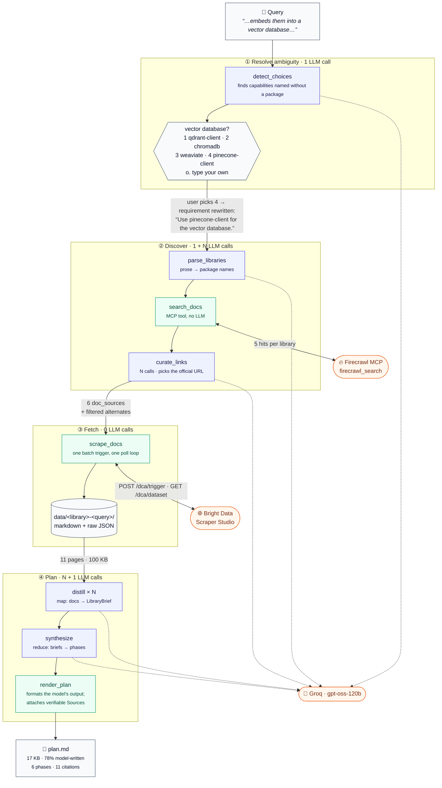

# Pipeline architecture

Traced with a real run. The query:

> Build a production RAG service that ingests PDF manuals, chunks and embeds them
> into **a vector database**, and exposes a FastAPI endpoint that answers questions
> with citations back to the source page. Use pypdf for extraction, LangChain for the
> retrieval chain and Pydantic models for request and response validation. Include
> streaming responses and health checks.

Which produced 6 libraries, 11 scraped pages (100 KB), and a 17 KB plan with 11
citations — for **15 LLM calls**.

Blue = makes an LLM call. Green = makes none. Orange = an external service.

**The plan itself is written by the model.** `synthesize` produces the overview,
phases and tasks; `distill` produces the per-library reference. Measured on this run,
**78% of `plan.md` is model-written prose and code**. What `render_plan` adds is the
formatting and the Sources table — the part the model is deliberately not trusted with.

## What happens at each step

| Stage | Calls | Input → Output |
|---|---|---|
| `detect_choices` | 1 | requirement → open capability slots with candidate packages |
| `parse_libraries` | 1 | requirement → `fastapi, pypdf, langchain, pydantic, pinecone-client, uvicorn` |
| `search_docs` | **0** | each library → 5 candidate URLs from Firecrawl |
| `curate_links` | **N** | 5 candidates → 1 official URL + confidence + alternates |
| `scrape_docs` | **0** | 11 URLs → 100 KB of markdown in `data/` |
| `distill` | **N** | one library's pages → `LibraryBrief` (install, APIs, gotchas) |
| `synthesize` | 1 | all briefs → ordered phases with `[^key]` markers |
| `render_plan` | **0** | draft + briefs → `plan.md` markdown + Sources table |

**Total: `2N + 3`.** Six libraries → 15 calls.

## Why two stages use no LLM

`search_docs` and `scrape_docs` are deterministic. We already know what to search for
(`"<library> official documentation"`) and exactly which URLs to fetch, so a model in
the loop would add cost and nondeterminism without adding judgment. The model is used
only where judgment is genuinely needed: choosing *which* result is the real
documentation, and condensing what it says.

## Why planning is map-reduce

The corpus does not fit in one context window — this run scraped 100 KB, and wide
queries reach ~500 KB, against a ~12 KB per-request budget. So each library is
distilled independently (**map**), then one call writes the plan from the briefs alone
(**reduce**). The synthesis step never sees the raw pages.

## Who writes what

The model writes the plan; code assembles and verifies it.

| Part of `plan.md` | Written by | Share of this run |
|---|---|---|
| Overview, phases, tasks, pitfalls, API reference | **the model** | **78%** |
| `## Sources` table and footnote definitions | code | 18% |
| `## Stack` table structure (values from the model) | code | 3% |

The `[^key]` markers *inside* the prose are the model's — it decides which claim rests
on which source. The footnote **definitions** are not: `render_plan` builds them from
the documents actually stored on disk, so a marker can only ever resolve to a page that
was really scraped, and each entry carries the URL, local path and sha256 of the exact
snapshot. Unreferenced sources are dropped, so the table never overstates the grounding.

That split is the point: the model is trusted to write, and not trusted to say where
its claims came from.

## Seeing a run

With `LANGSMITH_TRACING=true`, one CLI invocation is one LangSmith trace. The stages
below map onto spans: LangGraph emits one per node, and `ark/tracing.py` fills in the
non-LangChain work (Bright Data, the store, HTML cleaning, plan rendering) so the
timeline has no gaps.

The decisions worth reading are attached as span metadata rather than logged:
`parse_libraries` records what the model proposed versus what survived deduplication,
`curate_one_library` records the URL chosen and whether a guard had to override it,
`groq.invoke` records how many retries a rate limit cost, and `distill_library` records
the budget each 413 forced it to halve. See the Tracing section of the README for the
tree and for what is redacted before upload.

## Re-running cheaply

`ark plan <artifact.json>` re-enters at stage ④ using the already-stored pages:
**N + 1 calls**, no Firecrawl credits, no Bright Data records. That is the loop to use
when tuning plan quality or recovering from a truncated run.
